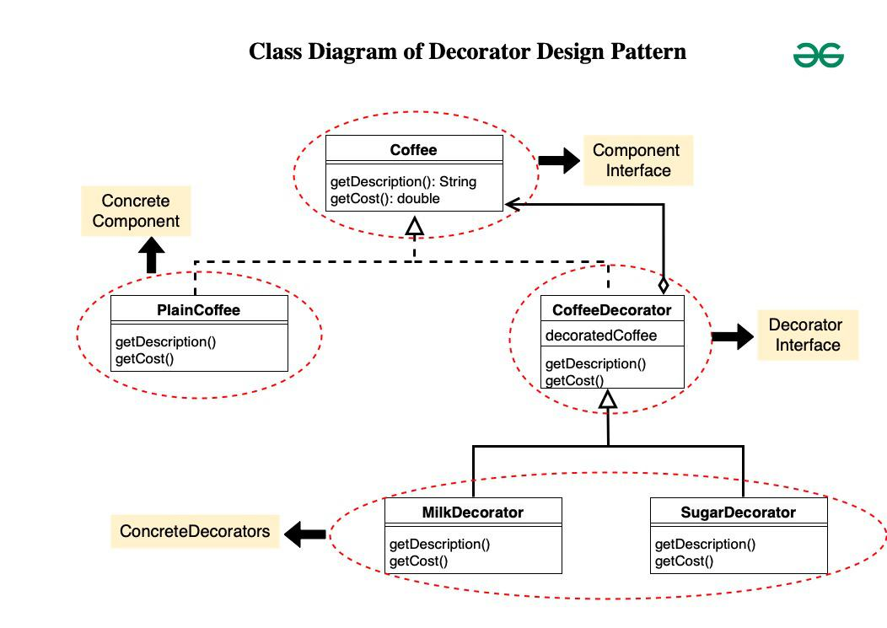

## Decorator Design Pattern Class Diagram
Deocorator design pattern is a structural design pattern.

We use the Decorator pattern when we need to add new features or behavior to an object at runtime without altering its original class.

