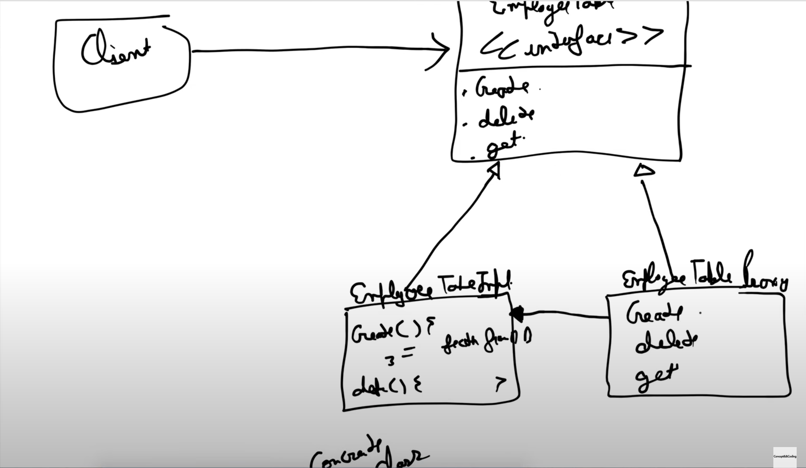

## Proxy Design Pattern

Proxy design pattern can be used for following functionalities:
1. **Access control**: Proxy object check for access before sending request to the real object.

2. **Caching**: Proxy object checks if the data is already present before sending the request to real object.

3. **Pre-processing and Post-processing**: Proxy object does some pre or post processing like logging before sending request to real object.

