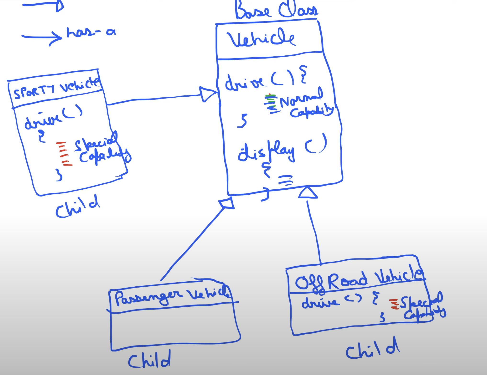
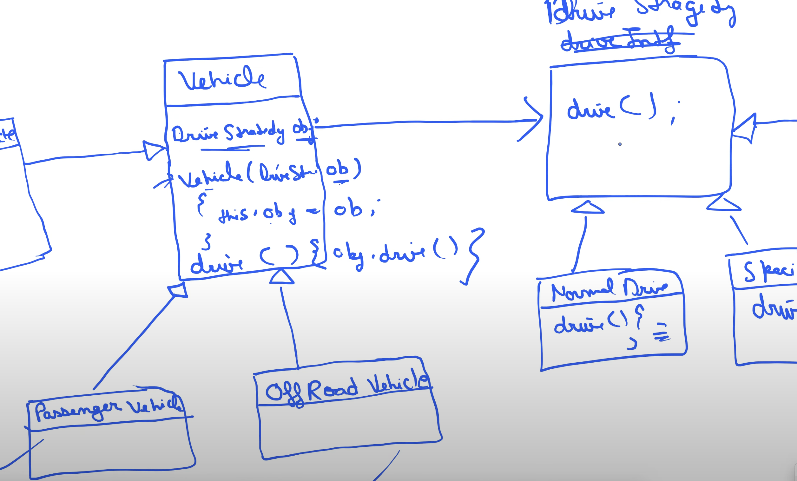

## Strategy Design Method Class Diagram

#### Since there are only 2 strategies, we don't have to write the logic in every subclass.
#### We just need to write logic once for every strategy

1. **Vehicle** is the base class
2. **Child** classes may need to write their own strategy logic again and again.

3. **Strategy** : Interface that defines the strategy.
4. We have two strategies implementing **Strategy** interface, so we need to write the logic for each strategy only once.
5. Child class will call super constructor with the strategy object.
6. Base class has object of Strategy interface and the concrete strategy classes will be assigned using constructor injection.

