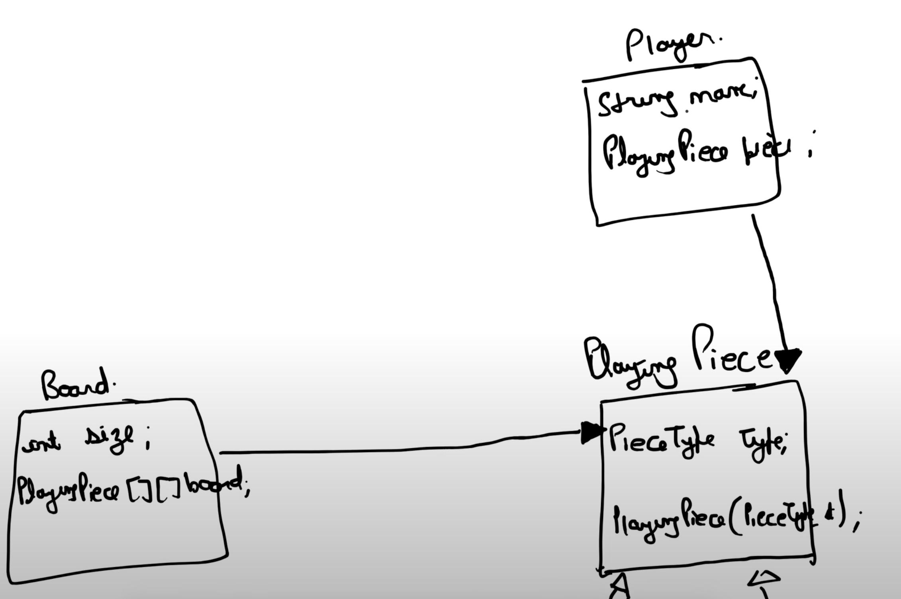
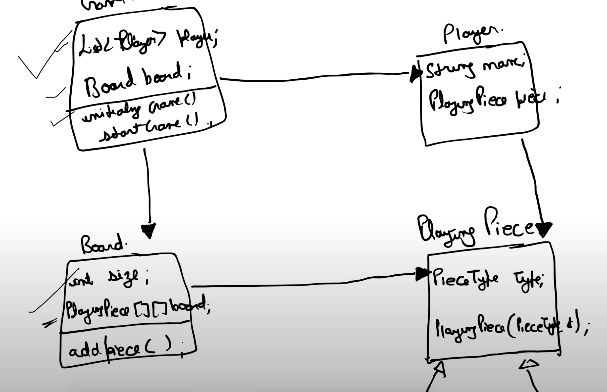

## Tic Tac Toe Game Low Level Design

### Create a Piece Type enum and PlayingPiece Class

PlayingPiece Class

### Create a Board Class and Player Class
Board and Player class has a reference to PlayingPiece class.

### Create a Game Class
Game class has a reference to Board and Player class.
